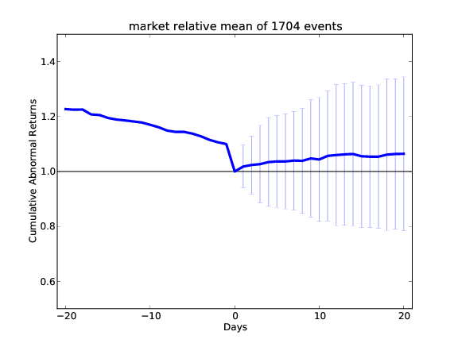
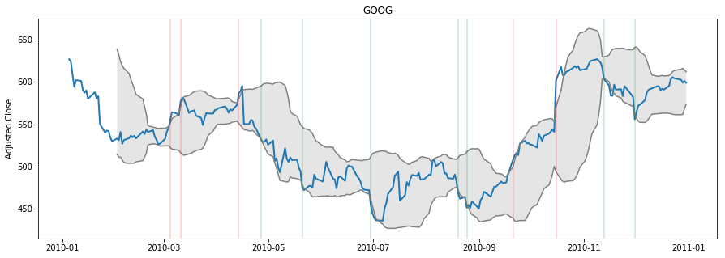

# Computational-Investing
Homework - Coursera course  
Computational Investing, Part I 
##### https://www.coursera.org/learn/computational-investing   

---------------------------

## About the course
Why do the prices of some companies’ stocks seem to move up and down together while others move separately? 
What does portfolio “diversification” really mean and how important is it? 
What should the price of a stock be? How can we discover and exploit the relationships between equity prices automatically? 
We’ll examine these questions, and others, from a computational point of view. 
You will learn many of the principles and algorithms that hedge funds and investment professionals use to maximize return and reduce risk in equity portfolios.

---------------------------
## Examples
__Event Study:__

__Technical Analysis:__

